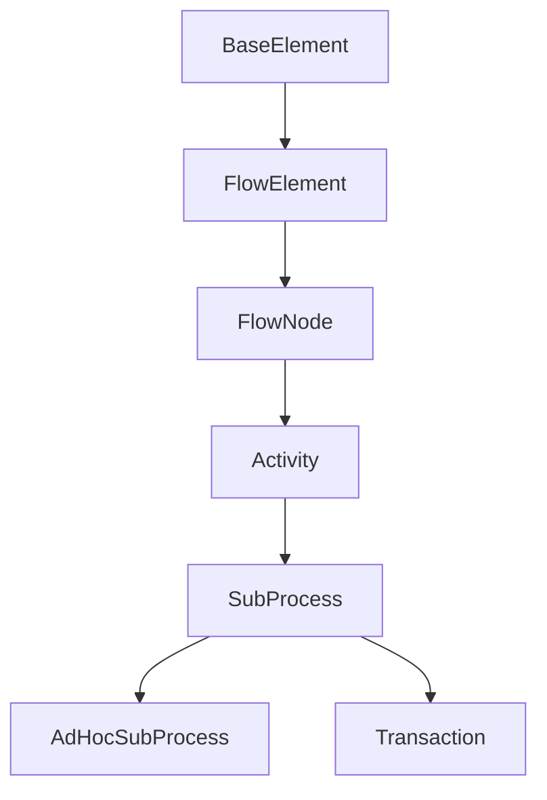

# SubProcess Sınıfı

## Genel Bakış

`SubProcess` sınıfı, BPMN 2.0 standardında tanımlanan bir Alt Süreci temsil eder. Bir ana süreç içerisindeki bir dizi ilgili adımı veya alt akışı mantıksal olarak gruplamak için kullanılan bir aktivite türüdür. Alt Süreçler, süreç modellerinde hiyerarşi oluşturmaya ve karmaşıklığı yönetmeye yardımcı olur.

## BPMN Tipi

- **Alt Süreç (Sub-Process)**

## Konumu

- **Namespace:** `Streamline.Domain.Schema.Activities`
- **Dosya:** `src/Streamline.Domain/Schema/Activities/SubProcess.cs`

## Kalıtım



- `SubProcess`, `Activity` sınıfından türetilmiştir. Bu sayede bir aktivitenin temel özelliklerini (ID, isim, döngü karakteristikleri vb.) ve davranışlarını miras alır.

## Amacı ve Kullanım Alanları

`SubProcess` sınıfının temel amaçları şunlardır:

1.  **Modülerlik:** Sürecin karmaşık bölümlerini ayrı birimler halinde kapsülleyerek ana süreci basitleştirmek.
2.  **Hiyerarşi:** Süreçleri daha küçük, yönetilebilir parçalara ayırarak yapılandırmak.
3.  **Tekrar Kullanım (Dolaylı):** Benzer adım grupları için bir yapı sunar, ancak doğrudan tekrar kullanım genellikle `CallActivity` ile sağlanır.
4.  **Kapsam Yönetimi:** Veri nesneleri, olaylar ve hata yönetimi için yerel bir kapsam tanımlamak.
5.  **Özel Davranışlar:**
    *   **Olay Alt Süreci (Event Sub-Process):** Belirli bir olayın meydana gelmesiyle tetiklenen alt süreçler (`TriggeredByEvent` özelliği).
    *   **İşlemsel Alt Süreç (Transactional Sub-Process):** Bir grup aktiviteyi atomik bir işlem olarak yürütmek (`Transaction` sınıfı).
    *   **Ad-hoc Alt Süreç (Ad-hoc Sub-Process):** İçindeki aktivitelerin belirli bir sırada olmadan yürütüldüğü esnek alt süreçler (`AdHocSubProcess` sınıfı).

## Temel Özellikler

| Özellik           | Tip                                          | Açıklama                                                                                                | XML Özelliği/Elementi |
| :---------------- | :------------------------------------------- | :------------------------------------------------------------------------------------------------------ | :-------------------- |
| `LaneSet`         | `Collection<LaneSet>`                        | Alt Süreç içindeki kulvar (swimlane) tanımlarını içerir.                                                  | `laneSet` (Element)   |
| `FlowElement`     | `Collection<FlowElement>`                    | Alt Sürecin iç mantığını oluşturan tüm akış elemanlarını (görevler, olaylar, ağ geçitleri vb.) barındırır. | Çeşitli (Element)     |
| `Artifact`        | `Collection<Artifacts.Artifact>`             | Alt Süreçle ilişkili yapıtları (gruplar, metin açıklamaları, ilişkiler) içerir.                          | Çeşitli (Element)     |
| `TriggeredByEvent` | `bool`                                       | Bu alt sürecin bir olay tarafından tetiklenip tetiklenmediğini belirtir (Olay Alt Süreci kontrolü).     | `triggeredByEvent` (Attribute) |
| `Inherited`       | `Activity`'den                               | ID, Name, Default, IsForCompensation, StartQuantity, CompletionQuantity, IoSpecification, Properties vb. | Çeşitli               |

## Bağımlılıklar

- **`Activity`:** Temel sınıf.
- **`FlowElement`:** Alt süreç içindeki çeşitli elemanlar (Task, Event, Gateway, SequenceFlow vb.).
- **`Artifacts.Artifact`:** İlişkili yapıtlar (Association, Group, TextAnnotation).
- **`LaneSet`:** Kulvar tanımları.
- **`AdHocSubProcess`, `Transaction`:** Türetilmiş özel alt süreç tipleri.

## Önemli Notlar

- `SubProcess`, bir sürecin bir bölümünü görsel olarak daraltıp genişletmek (collapsed/expanded view) için kullanılabilir.
- `FlowElement` koleksiyonu, alt sürecin kendi başlangıç ve bitiş olaylarına sahip olabilmesini sağlar.
- `TriggeredByEvent = true` olduğunda, alt süreç ana akıştan bağımsız olarak belirli bir olayın gerçekleşmesiyle başlar. Genellikle kesintiye uğratan (interrupting) veya kesintiye uğratmayan (non-interrupting) başlangıç olayları ile birlikte kullanılır.
- XML serileştirme öznitelikleri, BPMN 2.0 XML formatına uygunluğu ve farklı akış elemanı tiplerinin doğru şekilde işlenmesini sağlar.

## XML Örneği

### Gömülü Alt Süreç (Embedded Sub-Process)

```xml
<process id="MainProcess" isExecutable="true">
  <startEvent id="StartMain"/>
  <sequenceFlow id="Flow1" sourceRef="StartMain" targetRef="SubProc_1"/>

  <subProcess id="SubProc_1" name="Handle Order Details">
    <incoming>Flow1</incoming>
    <outgoing>Flow2</outgoing>

    <!-- Alt süreç içeriği -->
    <startEvent id="StartSub"/>
    <userTask id="Task_EnterDetails" name="Enter Order Details"/>
    <scriptTask id="Task_ValidateDetails" name="Validate Details" scriptFormat="text/javascript">
      <script>// validation logic</script>
    </scriptTask>
    <endEvent id="EndSub"/>
    <sequenceFlow id="FlowSub1" sourceRef="StartSub" targetRef="Task_EnterDetails"/>
    <sequenceFlow id="FlowSub2" sourceRef="Task_EnterDetails" targetRef="Task_ValidateDetails"/>
    <sequenceFlow id="FlowSub3" sourceRef="Task_ValidateDetails" targetRef="EndSub"/>
  </subProcess>

  <sequenceFlow id="Flow2" sourceRef="SubProc_1" targetRef="EndMain"/>
  <endEvent id="EndMain"/>
</process>
```

### Olay Alt Süreci (Event Sub-Process)

```xml
<process id="MainProcess" isExecutable="true">
  <!-- Ana süreç akışı -->
  <startEvent id="StartMain"/>
  <userTask id="Task_MainWork" name="Perform Main Work"/>
  <endEvent id="EndMain"/>
  <sequenceFlow id="FlowMain1" sourceRef="StartMain" targetRef="Task_MainWork"/>
  <sequenceFlow id="FlowMain2" sourceRef="Task_MainWork" targetRef="EndMain"/>

  <!-- Hata durumunda tetiklenen Olay Alt Süreci -->
  <subProcess id="EventSubProc_Error" name="Handle Error" triggeredByEvent="true">
    <startEvent id="StartEvent_ErrorTrigger" isInterrupting="true">
      <errorEventDefinition id="ErrorDef_1" errorRef="GlobalError_Critical"/>
    </startEvent>
    <scriptTask id="Task_LogError" name="Log Error" scriptFormat="C#">
      <script>log.Error("Critical error occurred.");</script>
    </scriptTask>
    <endEvent id="EndEvent_ErrorHandled" name="Error Handled"/>
    <sequenceFlow id="FlowError1" sourceRef="StartEvent_ErrorTrigger" targetRef="Task_LogError"/>
    <sequenceFlow id="FlowError2" sourceRef="Task_LogError" targetRef="EndEvent_ErrorHandled"/>
  </subProcess>
</process>
``` 