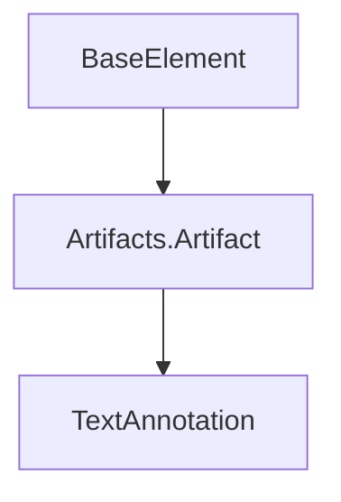

# TextAnnotation Sınıfı

## Genel Bakış

`TextAnnotation` sınıfı, BPMN 2.0 standardında tanımlanan bir Metin Açıklaması yapıtını (Artifact) temsil eder. Süreç diyagramlarına, süreç akışını doğrudan etkilemeyen ek bilgiler, notlar veya açıklamalar eklemek için kullanılır.

## BPMN Tipi

- **Yapıt (Artifact):** Metin Açıklaması (Text Annotation)

## Konumu

- **Namespace:** `Streamline.Domain.Schema.Artifact`
- **Dosya:** `src/Streamline.Domain/Schema/Artifact/TextAnnotation.cs`

## Kalıtım



- `TextAnnotation`, `Artifacts.Artifact` sınıfından türetilmiştir. Bu nedenle bir `Id`'ye sahiptir ancak süreç akışını (Sequence Flow) doğrudan etkilemez.

## Amacı ve Kullanım Alanları

Metin Açıklamalarının temel amacı, BPMN diyagramının okunabilirliğini ve anlaşılabilirliğini artırmaktır. Aşağıdaki gibi durumlarda kullanılır:

- Bir Akış Elemanının (örn. Görev, Olay, Ağ Geçidi) veya bir Sıra Akışının amacını veya davranışını açıklamak.
- Sürecin belirli bir bölümü hakkında ek bağlam veya detay sağlamak.
- Model okuyucuları için notlar veya hatırlatıcılar eklemek.

Metin Açıklamaları genellikle bir `Association` (İlişki) çizgisi kullanılarak ilgili BPMN elemanına bağlanır.

## Temel Özellikler

| Özellik     | Tip      | Açıklama                                                               | XML Özelliği/Elementi | Varsayılan Değer |
| :---------- | :------- | :--------------------------------------------------------------------- | :-------------------- | :--------------- |
| `Text`      | `TText`  | Açıklamanın metin içeriğini tutan nesne.                               | `text` (Element)      | -                |
| `TextFormat`| `string` | Metin içeriğinin formatını belirtir (örn. MIME türü).                 | `textFormat` (Attribute) | `"text/plain"`   |
| `Id`        | `string` | Elemanın benzersiz kimliği (Artifacts.Artifact'tan miras alınmıştır). | `id` (Attribute)      | -                |

## Bağımlılıklar

- **`Artifacts.Artifact`:** Temel sınıf.
- **`TText`:** Metin içeriğini tutan sınıf.
- **`Association` (Dolaylı):** Genellikle bir TextAnnotation'ı başka bir BPMN elemanına bağlamak için kullanılır.

## Önemli Notlar

- Metin Açıklamaları, sürecin yürütülme mantığını etkilemez. Sadece görsel ve açıklayıcı öğelerdir.
- `TextFormat` özelliği, metnin nasıl yorumlanması gerektiğini belirtir (örn. düz metin, HTML). Varsayılan olarak düz metin kabul edilir.
- BPMN diyagramlarında genellikle köşesi açık bir dikdörtgen ve içinde metin ile gösterilir.

## XML Örneği

```xml
<process id="Process_With_Annotation" isExecutable="true">
  <startEvent id="Start"/>
  <sequenceFlow id="Flow1" sourceRef="Start" targetRef="Task1"/>
  <userTask id="Task1" name="Review Application"/>
  <sequenceFlow id="Flow2" sourceRef="Task1" targetRef="End"/>
  <endEvent id="End"/>

  <!-- Metin Açıklaması -->
  <textAnnotation id="Annotation_1" textFormat="text/plain">
    <text>Ensure all sections of the application are complete before proceeding.</text>
  </textAnnotation>

  <!-- Açıklamayı Göreve Bağlama -->
  <association id="Association_1" sourceRef="Task1" targetRef="Annotation_1"/>
</process>
``` 