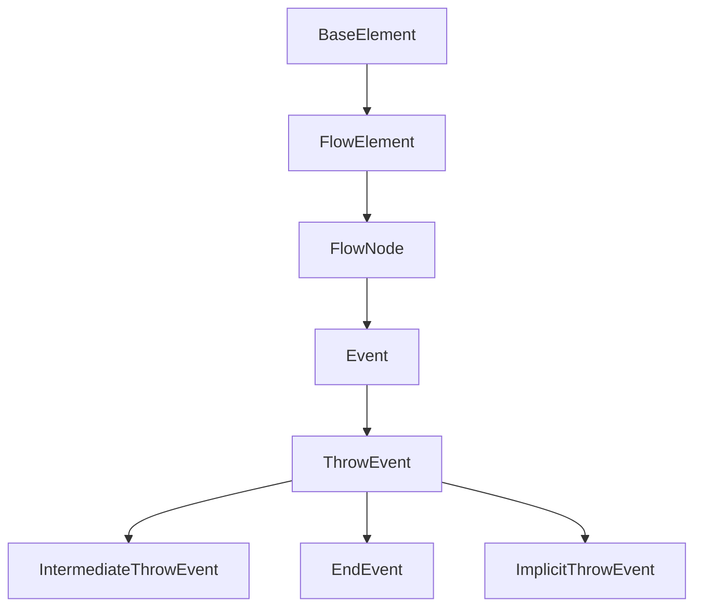

# ThrowEvent Sınıfı (Soyut)

## Genel Bakış

`ThrowEvent` sınıfı, BPMN 2.0 standardında bir olayı (event) "fırlatan" veya başlatan olay türleri için soyut bir temel sınıftır. Süreç akışı bir Fırlatma Olayına ulaştığında, olay tarafından tanımlanan eylem gerçekleştirilir (örneğin, bir mesaj gönderilir, bir sinyal yayınlanır, bir hata oluşturulur veya bir süreç sonlandırılır).

## BPMN Tipi

- **Olay (Event):** Fırlatma Olayı (Throw Event) - Soyut Temel Sınıf

## Konumu

- **Namespace:** `Streamline.Domain.Schema.Events`
- **Dosya:** `src/Streamline.Domain/Schema/Events/ThrowEvent.cs`

## Kalıtım



- `ThrowEvent`, `Event` sınıfından türetilmiştir ve bu nedenle `FlowNode`'un özelliklerini (gelen/giden sıra akışları, ID, isim vb.) miras alır.
- **Soyut Sınıf:** Doğrudan örneklenemez. Somut uygulamaları `IntermediateThrowEvent` ve `EndEvent` (ve `ImplicitThrowEvent`) sınıflarıdır.

## Amacı ve Kullanım Alanları

`ThrowEvent`'in amacı, süreç içinde bir olayın *aktif olarak* başlatılmasını veya gönderilmesini modellemektir. Bu, aşağıdaki durumlar için temel oluşturur:

- **Ara Fırlatma Olayları (`IntermediateThrowEvent`):** Süreç akışı devam ederken bir olayı tetikler (örn. bir mesaj gönderme, sinyal yayınlama, bir bağlantı üzerinden akışı başka bir yere yönlendirme).
- **Bitiş Olayları (`EndEvent`):** Bir süreç akışının sonlandığını ve sonlanırken belirli bir eylemi gerçekleştirdiğini belirtir (örn. bir sonuç mesajı gönderme, bir hata fırlatma, süreci tamamen sonlandırma).

## Temel Özellikler

| Özellik               | Tip                                            | Açıklama                                                                                                                               | XML Özelliği/Elementi       |
| :-------------------- | :--------------------------------------------- | :------------------------------------------------------------------------------------------------------------------------------------- | :-------------------------- |
| `DataInput`           | `Collection<DataInput>`                        | Olay fırlatıldığında kullanılacak veya gönderilecek verileri tanımlar.                                                                 | `dataInput` (Element)       |
| `DataInputAssociation`| `Collection<DataInputAssociation>`             | `DataInput`'ları süreçteki veri kaynaklarına (örn. Veri Nesneleri, özellikler) bağlar.                                                 | `dataInputAssociation` (Element) |
| `InputSet`            | `InputSet`                                     | Bu olay için gerekli olan `DataInput`'ların bir kümesini tanımlar.                                                                     | `inputSet` (Element)        |
| `EventDefinition`     | `Collection<EventDefinition>`                  | Fırlatılan olayın spesifik türünü tanımlar (örn. Mesaj, Sinyal, Hata, İptal, Telafi, Bağlantı, Tırmanma, Sonlandırma). Genellikle tek bir tanım içerir. | Çeşitli (Element)           |
| `EventDefinitionRef`  | `Collection<System.Xml.XmlQualifiedName>`    | Önceden tanımlanmış, tekrar kullanılabilir `EventDefinition`'lara referanslar içerir.                                                    | `eventDefinitionRef` (Element) |
| `Inherited`           | `Event`'ten                                    | ID, Name, Gelen/Giden Sıra Akışları, Özellikler vb.                                                                                  | Çeşitli                     |

## Türetilmiş Sınıflar

- **`IntermediateThrowEvent`:** Süreç akışı içinde bir olayı fırlatır.
- **`EndEvent`:** Süreç akışını sonlandırırken bir olayı fırlatır.
- **`ImplicitThrowEvent`:** Genellikle bir aktiviteye bağlı olarak örtük şekilde tetiklenen bir olay (daha az yaygın kullanılır).

## Bağımlılıklar

- **`Event`:** Temel sınıf.
- **`DataInput`, `DataInputAssociation`, `InputSet`:** Veri işleme ile ilgili sınıflar.
- **`EventDefinition` (ve alt türleri):** Olayın spesifik türünü tanımlayan sınıflar (örn. `MessageEventDefinition`, `SignalEventDefinition`, `ErrorEventDefinition`).

## Önemli Notlar

- `ThrowEvent`, olayları *fırlatan* veya *gönderen* taraftır. Olayları *yakalayan* veya *bekleyen* taraf `CatchEvent`'tir.
- Bir `ThrowEvent`'in ne tür bir olay fırlattığı (`Message`, `Signal`, `Error` vb.), içerdiği `EventDefinition` tarafından belirlenir.
- `EndEvent` bir `ThrowEvent` türü olduğundan, bir süreç yolu sadece bitmekle kalmaz, aynı zamanda bir sonuç (mesaj, sinyal, hata) da üretebilir.

## XML Örneği

`ThrowEvent` soyut olduğu için doğrudan XML'de kullanılmaz. Yerine somut alt sınıfları kullanılır:

### Ara Fırlatma Olayı (IntermediateThrowEvent - Sinyal)

```xml
<process ...>
  <intermediateThrowEvent id="Event_SignalSent" name="Send Update Signal">
    <incoming>Flow_ToSignal</incoming>
    <outgoing>Flow_FromSignal</outgoing>
    <signalEventDefinition signalRef="Signal_DataUpdated" />
  </intermediateThrowEvent>
</process>
```

### Ara Fırlatma Olayı (IntermediateThrowEvent - Mesaj)

```xml
<process ...>
  <dataObjectReference id="DataRef_Notification" dataObjectRef="DataObj_Notification"/>
  <intermediateThrowEvent id="Event_NotificationSent" name="Send Notification">
    <incoming>Flow_ToNotify</incoming>
    <outgoing>Flow_FromNotify</outgoing>
    <dataInput id="DataInput_NotificationMsg" name="NotificationContent"/>
    <dataInputAssociation>
      <sourceRef>DataRef_Notification</sourceRef>
      <targetRef>DataInput_NotificationMsg</targetRef>
    </dataInputAssociation>
    <inputSet>
      <dataInputRefs>DataInput_NotificationMsg</dataInputRefs>
    </inputSet>
    <messageEventDefinition messageRef="Message_Notification"/>
  </intermediateThrowEvent>
</process>
```

### Bitiş Olayı (EndEvent - Hata)

```xml
<process ...>
  <endEvent id="EndEvent_OrderFailed" name="Order Failed">
    <incoming>Flow_ToFailure</incoming>
    <errorEventDefinition errorRef="Error_OrderProcessingFailure"/>
  </endEvent>
</process>
```

### Bitiş Olayı (EndEvent - Sonlandırma)

```xml
<process ...>
  <endEvent id="EndEvent_ProcessTerminated" name="Process Terminated">
    <incoming>Flow_ToTerminate</incoming>
    <terminateEventDefinition/>
  </endEvent>
</process>
``` 